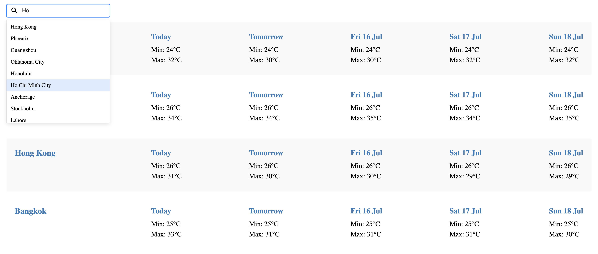
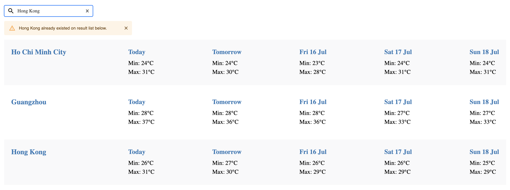
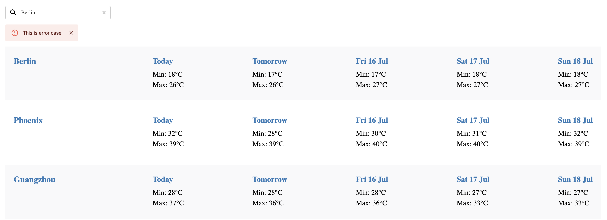

### Welcome to Weather Forecast application with features

Forecast weather status at cities over the world that shows the next 5 days weather of selected city

Some errors case will be displayed warning/error message

### How to use

1. Type city to search box and select one in suggested list
2. Weather on selected city will be shown in few seconds

### How to start on your machine

1. `git clone https://github.com/vankhanh/khanh-nab-weather.git`
2. `cd khanh-nab-weather`
3. `yarn install`
4. `yarn start`  
   **Note:** yarn@1.22.10, node@v14.16.0

### How to run test

-   `yarn test`

### Technical

-   Create React App: https://github.com/facebook/create-react-app
-   React Redux: https://react-redux.js.org/
-   redux-saga: https://redux-saga.js.org/
-   React Select: https://react-select.com/
-   Redux DevTools Extension: https://github.com/zalmoxisus/redux-devtools-extension
-   Redux Saga Test Plan: https://github.com/jfairbank/redux-saga-test-plan
-   Jest: Test framework
-   Enzyme: Test React components
-   Prettier: https://prettier.io/
-   husky: Pre commit
-   Styled-components: https://styled-components.com/

## API

MetaWeather: https://www.metaweather.com/api/

## What's good to have next

1. Friendly error to display if having any.
2. Show weather at your location and province nearly at your location.
3. Display location on map if User have to hover that will display detail the weather.
